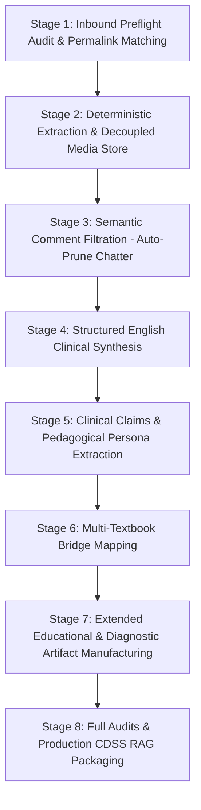

# Clinical Preceptor CDSS Architecture & Engineering Standards (v1.1.0)

## 1. Multi-Corpus Directory Partitioning

Every physician case corpus managed by this skill conforms to the standard 12-directory architecture:

| Partition | Directory | Purpose & Contents |
|---|---|---|
| **00** | `00_CONTROL/` | Master manifest, provenance ledger (SHA-256 digests), capture tracker, and schema definitions. |
| **01** | `01_RAW_SINGLEFILE/` | Immutable, verbatim SingleFile HTML captures organized into per-record isolation folders (`<rec_id>/<rec_id>__FULL.html`). |
| **02** | `02_RAW_MEDIA/` | Decoupled binary clinical assets (ECGs, X-rays, histopathology slides, diagrams) extracted and decoded from base64, plus `image_catalog.csv`. |
| **03** | `03_NORMALIZED_CORPUS/` | Deterministic structured JSONs (`POSTS/`, `COMMENTS/`, `REPLIES/`, `MEDIA_METADATA/`, `THREADS/`, `MARKDOWN/`, `JSON/`, `TABLES/`, `CLINICAL_COMMENTS/`, `ENGLISH_SYNTHESIS/`). |
| **04** | `04_PERSONA/` | Pedagogical profile, clinical heuristics, case framing conventions, folk allegories, and error correction registries. |
| **05** | `05_TEXTBOOK_BRIDGE/` | Bidirectional cross-references linking case teachings to authoritative textbooks (*Davidson 25th Edition*, *Harrison 22nd Edition*). |
| **06** | `06_DIAGNOSTICS/` | Fail-closed diagnostic logs and manual review folders (`MANUAL_REVIEW/`) for missing captures or duplicate files. |
| **07** | `07_AUDIT/` | Authorship audits, thread completeness checks, media verification, and master corpus audit summaries. |
| **08** | `08_EXPORTS/` | Production RAG JSONL packages, clinical claims tables, bilingual retrieval indices, and extended educational suites (`OSCE/`, `CURRICULUM/`, `GRAPH/`, `SBAR_HANDOVERS/`, `PATIENT_LEAFLETS/`, `ANKI/`, `PHARMACOVIGILANCE/`). |
| **99** | `99_BACKUP/` | Full safety backups with SHA-256 manifests created prior to any destructive pruning or corpus transformations. |
| **Zone** | `raw html/` | The designated inbound drop zone for new SingleFile HTML captures. |
| **Tools** | `tools/` | Local standalone Python scripts mirroring skill capabilities for offline portability. |

---

## 2. Eight-Stage Manufacturing Lifecycle

When running `--pipeline auto`, the orchestrator executes eight automated processing stages:

1. **Stage 1: Inbound & Preflight Audit**: Validates inbound SingleFile HTML files in `raw html/`, parses header comments for permalink URLs, matches titles or hashtags, identifies duplicate captures, and logs missing files in `06_DIAGNOSTICS/MANUAL_REVIEW/`.
2. **Stage 2: Deterministic Multi-Signal Extraction**: Uses `lxml.html` to extract post bodies, timestamps, reactions, and decodes base64-encoded clinical images into `02_RAW_MEDIA/` with unique filenames, dimension filtering, and SHA-256 digests.
3. **Stage 3: Semantic Comment Noise Pruning**: Applies bilingual clinical terminology and social filters to delete redundant social pleasantries ("thanks", "nice post", emojis), preserving only verified clinical discussions and author teaching.
4. **Stage 4: Structured English Clinical Synthesis**: Translates and synthesizes bilingual or local-language case posts into standardized medical English documentation (vignette, molecular mechanisms, diagnostic algorithms, therapeutic protocols, prescribing contraindications, and pearls).
5. **Stage 5: Clinical Claims & Persona Modeling**: Extracts typed clinical claims (`DIFFERENTIAL`, `INVESTIGATION`, `TREATMENT`, `CONTRAINDICATION`, `MECHANISM`, `CALCULATION_HEURISTIC`, `EMERGENCY_MANAGEMENT`) enforcing default status `current_validity_status = NOT_ASSESSED`.
6. **Stage 6: Multi-Textbook Bridging**: Links clinical pearls to *Davidson 25th Edition* and *Harrison 22nd Edition* chapters, recording concordance notes, nuances, and temporal drift reviews.
7. **Stage 7: Extended Modalities Manufacturing**: Automatically compiles OSCE visual spotters (`OSCE/visual_spotters.jsonl`), residency curriculum tiers (`residency_curriculum_tiers.csv`), GraphRAG causal decision graphs (`GRAPH/causal_knowledge_graph.jsonl`), emergency SBAR cards (`SBAR_HANDOVERS/`), Bengali patient counseling sheets (`PATIENT_LEAFLETS/`), Anki cloze decks (`ANKI/habijabi_high_yield_anki_deck.tsv`), and ward toxic drug matrices (`PHARMACOVIGILANCE/`).
8. **Stage 8: CDSS RAG Packaging & Full Audits**: Generates semantic RAG chunks (`habijabi_kawsar_cdss.jsonl`, `habijabi_english_cdss.jsonl`, `high_yield_clinical_qa.jsonl`) and executes authorship, completeness, and media SHA-256 audits.

---

## 3. The 13 Full-Spectrum Clinical Runtime Modalities

| # | Modality | CLI Argument | Core Function | Target Users |
|---|---|---|---|---|
| **1** | Socratic Ward Preceptor | `--preceptor <query>` | Morning report & ward round simulation with mechanisms-first reasoning | Interns & Registrars |
| **2** | Postgraduate SBA Generator | `--exam-sba [rec_id]` | FCPS Part 1 / MRCP / MD Single Best Answer question generator with dual citations | Exam Candidates |
| **3** | Prescribing Safety Interceptor | `--prescribing-safety <query>` | Halts defensive prescribing traps (e.g. allopurinol in acute gout, dengue fluid overload) | Junior Prescribers |
| **4** | Federated 4-Textbook Grounding | `--federated <topic>` | Simultaneous cross-referencing across Davidson 25, Harrison 22, Hurst 15, Kumar & Clark 11 | Senior Clinicians |
| **5** | Tropical Ward Calculator | `--tropical-calc <type>` | Bedside arithmetic for gravity IV giving sets (drops/min), dengue deficits, Mentzer index | Ward Duty Staff |
| **6** | Diagnostic Facilities Lookup | `--ward-facilities <test>` | Local clinical laboratory navigation directory in Dhaka, Bangladesh | Ward Duty Staff |
| **7** | Hybrid Bilingual Retrieval | `--search <query>` | Sub-millisecond vector/keyword search across Bengali prose & English synthesis | All Researchers |
| **8** | Clinical OSCE Visual Spotters | `--visual-spotter [id]` | Image-based spot diagnosis stations (ECGs, PBFs, clinical photos) with answer keys | OSCE Examinees |
| **9** | Residency Curriculum | `--curriculum [tier]` | Tiered competency milestones (Tier 1: Intern, Tier 2: MO/GP, Tier 3: FCPS/MRCP) | Training Supervisors |
| **10** | GraphRAG Causal Graph | `--causal-graph [query]` | Traversal of pathophysiological causal triplets (Subject-Predicate-Object) | CDSS Reasoning AI |
| **11** | Acute Ward SBAR Handovers | `--sbar [condition]` | Standardized on-call night duty handover cards (Situation-Background-Assessment-Rec) | On-Call Medical Officers |
| **12** | Bengali Patient Leaflets | `--patient-leaflet [topic]`| Empathy-driven health literacy sheets in colloquial Bengali using Kawsar's folk allegories | Patients & Caregivers |
| **13** | High-Yield Anki Cloze Decks | `--anki-deck [query]` | Spaced-repetition flashcard export (.tsv) for rapid active recall examination cramming | Medical Students & Trainees |
| **14** | Toxic Drug Never-Events | `--never-events [drug]` | Tabular pharmacovigilance matrix of lethal drug combinations and safe alternatives | Hospital Safety Committees |
