# Medical RAG Master Orchestrator (v1.4.0)

Production-grade lifecycle orchestrator that chains and governs the end-to-end transformation of raw medical textbook PDFs into production-grade Clinical Decision Support System (CDSS) retrieval packages and journal-grade Cognitive Bridge Notes.

---

## 🎯 When to Activate This Skill

Activate this skill whenever:
- Starting or continuing the RAG conversion of a new or existing medical textbook (*Davidson*, *Harrison*, *Hurst*, *Braunwald*, *Kumar & Clark*).
- Ingesting newly downloaded OCR batches from Mistral OCR Playground / Document AI into textbook section folders.
- Running the sequential pipeline across chapters:
  $$\text{Gate 0 (Unicode Guard)} \longrightarrow \text{Organizer} \longrightarrow \text{Pre-Ready Inliner} \longrightarrow \text{18-Stage RAG Pipeline} \longrightarrow \text{Index Compiler} \longrightarrow \text{CDSS Packager} \longrightarrow \mathbf{\text{Stage 6 (Bridge Publisher)}}$$
- Synthesizing discrete, journal-grade Cognitive Bridge Notes from compiled chapters (`orchestrator.py publish-note` or `publish-manifest`).
- Verifying pipeline tools zero-drift version consistency across all skills (`orchestrator.py verify-versions`).
- Auditing the completion state of a textbook corpus (`orchestrator.py status`).
- Packaging compiled books and deploying them to `D:\01_Medical_Study\CDSS_Retrieval_Package`.

---

## 🏗️ The 7-Stage Manufacturing Pipeline

```mermaid
flowchart TD
    subgraph S0["Gate 0: Encoding & Safety Sanitizer"]
        G0["cdss-unicode-mojibake-guard<br/>guard.py fix --enforce-ismp"]
        G0 -->|Fixes CP1252 & µg to mcg| A
    end

    subgraph S1["Stage 1: Ingestion & Layout"]
        A["medical-book-split-ocr-organizer<br/>organizer.py auto"]
        A -->|Normalizes directories & moves OCR| B["Structured Section / ocr markdown/"]
    end

    subgraph S2["Stage 2: OCR Inlining & Asset Decoupling"]
        B --> C["davidson-ocr-preready<br/>preready.runner"]
        C -->|Inlines tbl-*.md & maps chNN_fig_MM.jpeg| D["*.markdown_inlined.md + assets/figures/"]
    end

    subgraph S3["Stage 3: 18-Stage RAG Extraction"]
        D --> E["davidson-rag-pipeline-antigravity<br/>pipeline.run_stage --stage auto"]
        E -->|Semantic chunking & clinical validation gates| F["*_RAG_Optimised.md + *_chunks.md"]
    end

    subgraph S4["Stage 4: Index Intelligence Compilation"]
        F --> G["medical-index-rag-compiler<br/>scripts.compiler"]
        G -->|Compiles GraphRAG, GBNF, BM25, and safety matrix| H["26 Index Intelligence Assets"]
    end

    subgraph S5["Stage 5: CDSS Deployment & Federated Search"]
        H --> I["cdss-retrieval-packager<br/>packager.py auto"]
        I -->|Prunes QA scorecards & patches relative paths| J["CDSS_Retrieval_Package / cdss_federated_search.py"]
    end

    subgraph S6["Stage 6: Cognitive Bridge Note Publisher"]
        J --> K["cdss-bridge-note-publisher<br/>orchestrator.py publish-note / publish-manifest"]
        K -->|Lanczos-4 figures + Native XML card grids| L["Canonical Markdown (.md) + Executive Word Document (.docx)"]
    end
```



---

## 💻 CLI Quick-Start

The master orchestrator runner is located at `scripts/orchestrator.py`:

### 1. Audit Book Status
Scans all chapter directories and reports whether PDF, OCR, Inlined markdown, Chunks, and Optimized files exist:
```powershell
python "C:\Users\User\.gemini\config\skills\medical-rag-orchestrator\scripts\orchestrator.py" status `
  --book-dir "D:\01_Medical_Study\SPLIT Pdfs\Davidson_25_Split"
```

### 2. Stage 1: Ingest & Organize OCR Downloads
Moves raw Mistral OCR folders from Downloads into matching book section folders:
```powershell
python "C:\Users\User\.gemini\config\skills\medical-rag-orchestrator\scripts\orchestrator.py" organize `
  --target-dir "D:\01_Medical_Study\SPLIT Pdfs\Davidson_25_Split" `
  --source-dir "C:\Users\User\Downloads"
```

### 3. Stage 2: Inline Tables & Figures (Pre-Ready)
Transforms raw OCR page folders into a clean `markdown_inlined.md` and decoupled `assets/figures/`:
```powershell
python "C:\Users\User\.gemini\config\skills\medical-rag-orchestrator\scripts\orchestrator.py" preready `
  --chapter-dir "D:\01_Medical_Study\SPLIT Pdfs\Davidson_25_Split\Davidson_25_Ch01_Clinical_decision-making"
```

### 4. Stage 3: Execute Chapter RAG Pipeline
Runs all 18 deterministic stages with validation gating:
```powershell
python "C:\Users\User\.gemini\config\skills\medical-rag-orchestrator\scripts\orchestrator.py" rag `
  --source "D:\01_Medical_Study\SPLIT Pdfs\Davidson_25_Split\Davidson_25_Ch01_Clinical_decision-making\Davidson_25_Ch01.markdown_inlined.md"
```

### 5. Stage 4: Compile Book-Wide Index Intelligence
Synthesizes the complete 26-asset index suite once all chapters are RAG-ready:
```powershell
python "C:\Users\User\.gemini\config\skills\medical-rag-orchestrator\scripts\orchestrator.py" index `
  --book "Davidson's Principles and Practice of Medicine" `
  --edition "25th Edition" `
  --corpus "D:\01_Medical_Study\SPLIT Pdfs\Davidson_25_Split" `
  --index "D:\01_Medical_Study\SPLIT Pdfs\Davidson_25_Split\Index\markdown_inlined.md" `
  --output "D:\01_Medical_Study\SPLIT Pdfs\Davidson_25_Split\Index\rag_pipeline_output"
```

### 6. Stage 5: Package, Prune & Federate
Deploys the compiled book to the production CDSS package, prunes temporary scorecards, and updates `cdss_federated_search.py`:
```powershell
python "C:\Users\User\.gemini\config\skills\medical-rag-orchestrator\scripts\orchestrator.py" package `
  --package-dir "D:\01_Medical_Study\CDSS_Retrieval_Package"
```

### 7. Stage 6: Publish Cognitive Bridge Notes (Zero Blind Guessing)
Synthesize a discrete, fully-grounded Cognitive Bridge Note and executive Word `.docx` with Native XML Card Grid Tables:
```powershell
# On-Demand Single Topic:
python "C:\Users\User\.gemini\config\skills\medical-rag-orchestrator\scripts\orchestrator.py" publish-note `
  --topic "Cardiac Auscultation & Pathological Murmurs" `
  --output-dir "D:\01_Medical_Study\CDSS_human_test"

# Declarative Multi-Topic Chapter Manifest:
python "C:\Users\User\.gemini\config\skills\medical-rag-orchestrator\scripts\orchestrator.py" publish-manifest `
  --manifest "C:\Users\User\.gemini\config\skills\medical-rag-orchestrator\references\sample_chapter_16_manifest.json" `
  --output-dir "D:\01_Medical_Study\CDSS_human_test"
```

### 8. Pipeline Sub-Skills Zero-Drift Version Audit
Leverages `version-manager`'s `--suite` engine to verify 100% version agreement across all skills in a single command:
```powershell
python "C:\Users\User\.gemini\config\skills\medical-rag-orchestrator\scripts\orchestrator.py" verify-versions
```

---

## 🛡️ Sub-Skills Inventory & Handover Contracts

This master orchestrator governs the following modular sub-skills:
- [`cdss-unicode-mojibake-guard`](../cdss-unicode-mojibake-guard/SKILL.md): Pre-flight Gate 0 corpus audit, UTF-8 normalization, BOM stripping, and ISMP safety.
- [`medical-book-split-ocr-organizer`](../medical-book-split-ocr-organizer/SKILL.md): Raw PDF split staging and OCR ingestion.
- [`davidson-ocr-preready`](../davidson-ocr-preready/SKILL.md): Table inlining, caption standardization, running header stripping.
- [`davidson-rag-pipeline-antigravity`](../davidson-rag-pipeline-antigravity/SKILL.md): 18-stage chunking, span coverage gates, clinical fidelity checks.
- [`medical-index-rag-compiler`](../medical-index-rag-compiler/SKILL.md): 26-asset index compilation, GBNF grammars, drug safety matrix.
- [`cdss-retrieval-packager`](../cdss-retrieval-packager/SKILL.md): Pruning, relative path patching, multimodal asset preservation, federated search CLI.
- [`cdss-bridge-note-publisher`](../cdss-bridge-note-publisher/SKILL.md): Autonomous Stage 6 Cognitive Bridge Note publisher, Lanczos-4 figure enhancement, and Native Word Card Grid generator.

---

## 🔄 Pre-Done Stage Resumption & Skip-Logic Protocol

When orchestrating large medical textbook corpora (20 to 50 chapters), stages are frequently completed incrementally. The orchestrator employs deterministic skip-logic to ensure idempotent execution and prevent redundant compute:

### 1. Chapter Lifecycle States

Each chapter directory is evaluated by `audit_book_status` into one of five deterministic states:
1. `NOT STARTED`: No PDF or OCR files present.
2. `PDF ONLY`: Split source PDF exists, but no OCR markdown has been extracted.
3. `OCR INGESTED`: `ocr markdown/` folder exists and contains raw Mistral OCR outputs.
4. `INLINED`: Table and figure inlining completed (`*markdown_inlined.md` exists).
5. `RAG READY`: Complete 18-stage RAG extraction completed (`*_RAG_Optimised.md` exists in `rag_pipeline_output/`).

### 2. Stage Behavior When Artifacts Are Pre-Done

| Stage | Governed Skill | Pre-Done Condition | Default Orchestrator Behavior |
| :--- | :--- | :--- | :--- |
| **Gate 0** | `cdss-unicode-mojibake-guard` | Corpus already UTF-8 clean & ISMP compliant | **Idempotent Scan**: Verifies clean encoding with zero modifications. |
| **Stage 1** | `medical-book-split-ocr-organizer` | `ocr markdown/` already populated in chapter folder | **Non-Destructive**: Leaves existing chapter OCR intact; only moves newly detected downloads. |
| **Stage 2** | `davidson-ocr-preready` | `*markdown_inlined.md` already present | **Skips with `--skip-completed`**: Bypasses table/figure re-inlining and logs `[SKIP]`. |
| **Stage 3** | `davidson-rag-pipeline-antigravity` | `*_RAG_Optimised.md` already present in output | **Skips with `--skip-completed`**: Bypasses the 18 stages and validation gates, saving 100% of LLM/CPU cycles. |
| **Stage 4** | `medical-index-rag-compiler` | 26-asset index suite already in `Index/rag_pipeline_output` | **Idempotent Recompilation**: Re-indexes all `RAG READY` chapters into SQLite, GBNF, and GraphRAG. |
| **Stage 5** | `cdss-retrieval-packager` | Package already pruned and paths relative | **Idempotent Patching**: Re-prunes build scorecards, verifies zero broken paths, and regenerates federated CLI. |
| **Stage 6** | `cdss-bridge-note-publisher` | Note and `.docx` already generated in output directory | **Idempotent Synthesis**: Synthesizes discrete topic dossiers on-demand. |

### 3. Smart Resumption Commands

```powershell
# Run automated lifecycle while processing incomplete chapters and skipping completed ones:
python scripts/orchestrator.py auto --book-dir "D:\01_Medical_Study\SPLIT Pdfs\Davidson_25_Split" --process-chapters --skip-completed

# Pre-ready inliner with automatic skip for already inlined chapters:
python scripts/orchestrator.py preready --chapter-dir "D:\path\to\ch01" "D:\path\to\ch02" --skip-completed

# RAG pipeline with automatic skip for already RAG-ready chapters:
python scripts/orchestrator.py rag --source "D:\path\to\ch01.markdown_inlined.md" --skip-completed
```

## Trust Rule & Configuration (2026-09-25)
- `RAG READY` is decided by the RAG pipeline's own `classify_trust()` (the logic behind `CORPUS_TRUST_STATUS.md`), applied to the folder that holds `*_RAG_Optimised.md`.
- A `CORPUS_OUTPUT_PROTECTED.json` marker or the Stage 8 checkpoint flag alone is never trust. The Stage 8 flag is recorded before Stage 8 completes, so it reads `false` even for trusted chapters.
- When a chapter has several output folders (v22 copies, `*_extracted`, `*_candidate`), the canonical `rag_pipeline_output` folder decides. Backup, audit and bundle copies are ignored.
- Untrusted chapters are re-run under `--skip-completed`, never skipped.
- Pipeline exit code 3 means "finished but not trusted": `auto` warns and continues.
- `auto --no-skip-completed` forces re-runs.
- Paths: the skills root is derived from this file's location (override with `CDSS_SKILLS_ROOT`). The Downloads default is `~/Downloads` (override with `CDSS_DOWNLOADS_DIR`).
